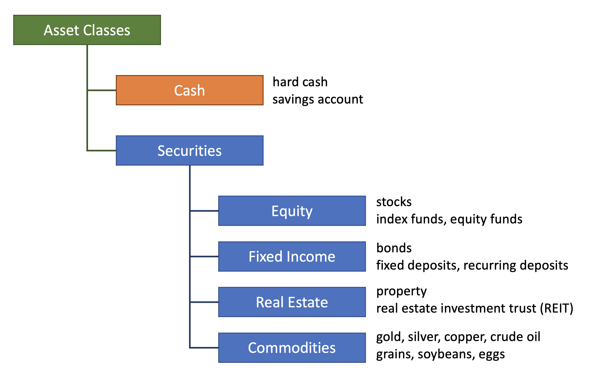
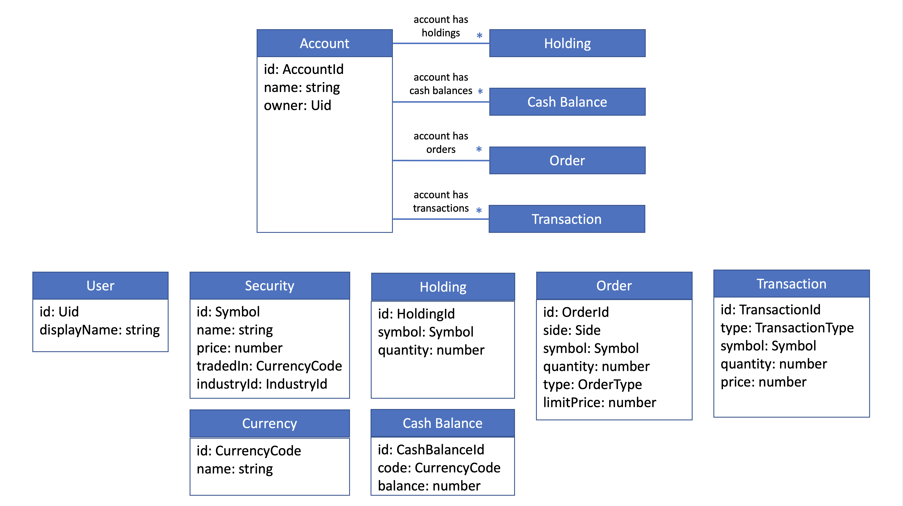

# Bullsfirst

Bullsfirst is an application to trade securities and manage investments.

## Visual Design

This
[Figma Project](https://www.figma.com/file/UdOTt1Z2fTnm0Cbi0FA1We/Bullsfirst)
contains the visual design for the Bullsfirst application. You will have to
create an account with Figma to be able to inspect the CSS values.

## Business Context

According to
[Investopedia](https://www.investopedia.com/terms/a/assetclasses.asp)

> An asset class is a grouping of investments that exhibit similar
> characteristics and are subject to the same laws and regulations.

### Classification of Asset Classes

### Bullsfirst Domain Model

## Exercises

1. [Home Page](exercises/exercise-1-home-page.md)
2. [Sign-in Page](exercises/exercise-2-sign-in-page.md)
3. [SideBar](exercises/exercise-3-sidebar.md)
4. [Accounts Page](exercises/exercise-4-accounts-page.md)

## Learning Resources

Note that Udemy courses listed below are available through PublicisSapient
Learning & Development teams.

### TypeScript

1. [Official TypeScript documentation](https://www.typescriptlang.org/docs/)
2. [TypeScript Deep Dive](https://basarat.gitbook.io/typescript/getting-started)
3. [Understanding TypeScript - Udemy](https://www.udemy.com/course/understanding-typescript/)

Key concepts to understand:

- Interfaces
- Functions
- Literal types
- Generics
- Classes (since React's move towards functional components, the class concept
  is surprisingly not that important)

### React

1. [React documentation](https://reactjs.org/docs/getting-started.html)
2. [React - The Complete Guide - Udemy](https://www.udemy.com/course/react-the-complete-guide-incl-redux/)
3. [React and Typescript](https://sapient.udemy.com/course/react-and-typescript-build-a-portfolio-project/)
4. [Dan Abramov's Blog](https://overreacted.io/)
5. [Kent Dodd's Blog](https://kentcdodds.com/)
6. [React+TypeScript Cheatsheets](https://github.com/typescript-cheatsheets/react)

### React Router

1. [Version 5 docs](https://github.com/ReactTraining/react-router/tree/dev/docs) -
   Note that v5 is in beta. The only up-to-date docs are here in the dev branch.

### React Hook Form

1. [React Hook Form documentation](https://react-hook-form.com/get-started)
2. [React Hook Form example with Yup validation](https://react-hook-form.com/get-started/#SchemaValidation)
3. [Complex form example](https://github.com/nareshbhatia/form-examples)

### React Testing Library

1. [Introduction](https://testing-library.com/docs/)
2. [Guiding Principles](https://testing-library.com/docs/guiding-principles)
3. [Example](https://testing-library.com/docs/react-testing-library/example-intro)
4. [Cheatsheet](https://testing-library.com/docs/react-testing-library/cheatsheet)

### Storybook

1. [Introduction to Storybook](https://storybook.js.org/docs/react/get-started/introduction)

### Mock Service Worker

1. [Documentation](https://mswjs.io/docs/)

### Cypress

1. [Documentation](https://docs.cypress.io/guides/overview/why-cypress)

### Visual Design

1. [Refactoring UI](https://www.refactoringui.com/) (written by the authors of
   Tailwind CSS)
2. [Foundations of Design Systems - Emma Wedekind](https://www.youtube.com/watch?v=pXb2jA43A6k)

### Domain-Driven Design

1. [Naresh Bhatia's Blog](https://archfirst.org/domain-driven-design/)
