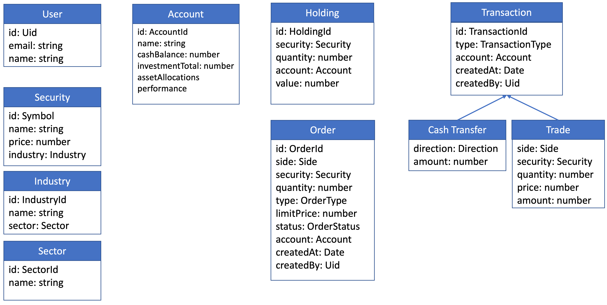

# Bullsfirst

Bullsfirst is an application to trade securities and manage investments.

## Visual Design

This
[Figma Project](https://www.figma.com/file/UdOTt1Z2fTnm0Cbi0FA1We/Bullsfirst)
contains the visual design for the Bullsfirst application. You will have to
create an account with Figma to be able to inspect the CSS values.

## Business Context

According to
[Investopedia](https://www.investopedia.com/terms/a/assetclasses.asp)

> An asset class is a grouping of investments that exhibit similar
> characteristics and are subject to the same laws and regulations.

### Classification of Asset Classes

### Bullsfirst Domain Model

### Model Objects

## Exercises

1. [Home Page](exercises/exercise-1-home-page.md)
2. [Sign-in Page](exercises/exercise-2-sign-in-page.md)
3. [Authentication - Sign In](exercises/exercise-3-authentication-sign-in.md)
4. [Authentication - Sign Up](exercises/exercise-4-authentication-sign-up.md)
5. [SideBar](exercises/exercise-5-sidebar.md)
6. [Accounts Page](exercises/exercise-6-accounts-page.md)
7. [Net Worth](exercises/exercise-7-net-worth.md)
8. [Asset Allocation Chart](exercises/exercise-8-asset-allocation-chart.md)
9. [Performance Chart](exercises/exercise-9-performance-chart.md)
10. [Refresh Button](exercises/exercise-10-refresh-button.md)
11. [Holdings](exercises/exercise-11-holdings.md)
12. [Orders](exercises/exercise-12-orders.md)

## Learning Resources

See [here](docs/learning-resources.md)
