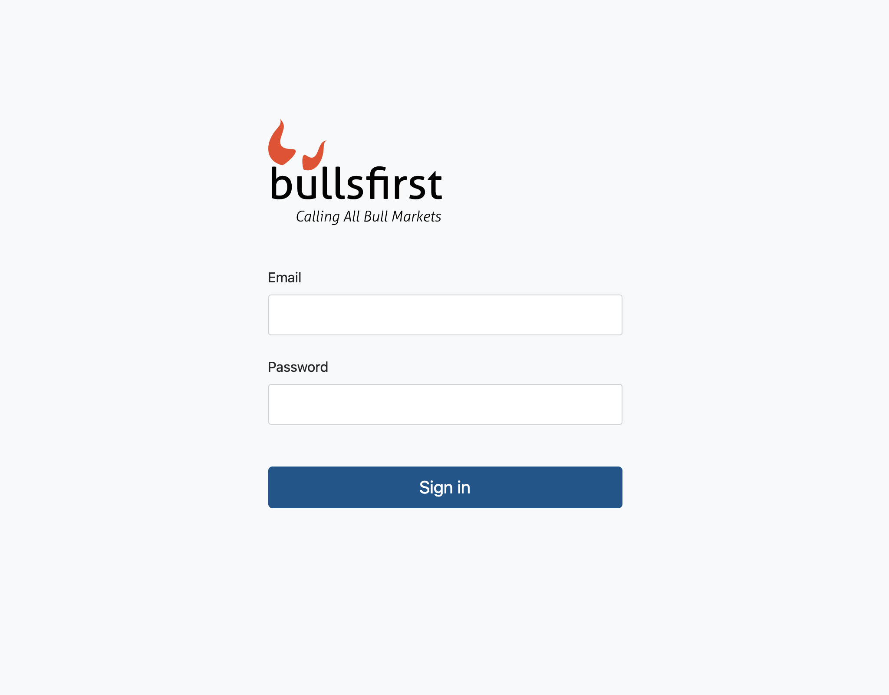
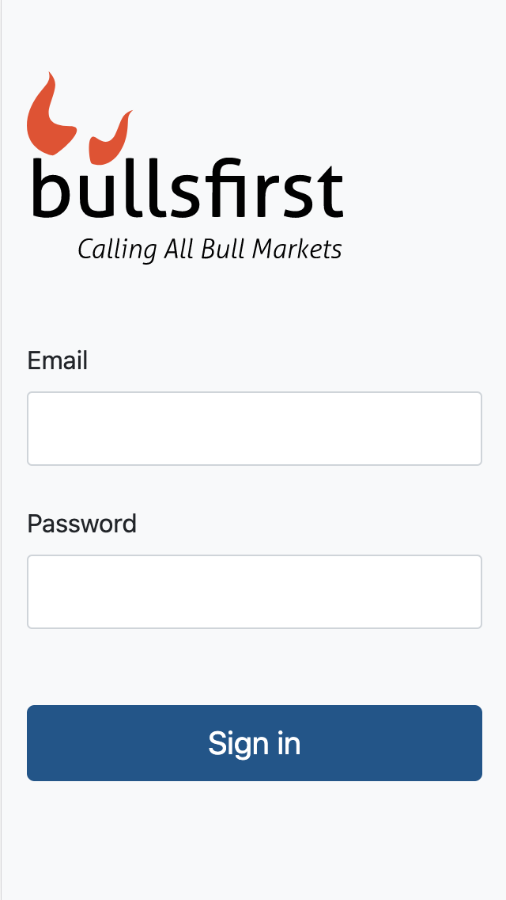
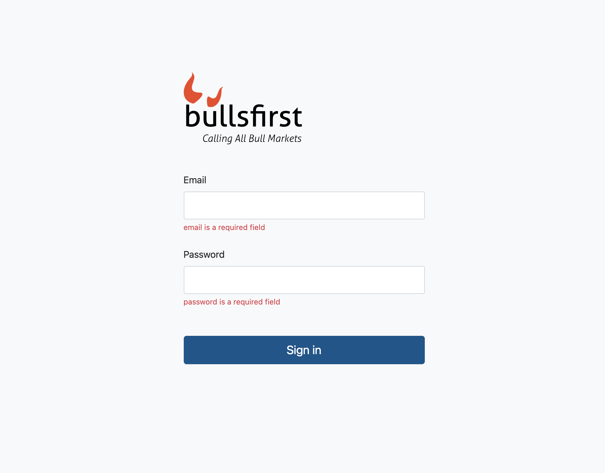

# Exercise 1: Sign-In Page

Implement the sign-in page as shown below. This is a responsive page and should
look good on mobile, tablets and desktop. Make sure that the sign-in form is
centered horizontally and slightly above the center vertically. A good approach
is to distribute one-third of the empty space above and two-thirds below the
form.

### Sign-in Page | Desktop



### Sign-in Page | Mobile



### Sign-in Page | Validations



## General Guidelines

- Use only CSS to style your components.
- Use CSS Variables to ensure that you are not repeating color values, spacings
  etc.
- You may use a lightweight CSS framework like
  [Chota](https://jenil.github.io/chota/) to get you started. See
  [Accelerated News](https://github.com/PublicisSapient/accelerated-news) for an
  example.
- Use [BEM](https://en.bem.info/) to properly namespace your styles.
- Use react-icons to render icons.
- Use react-hook-form and yup for form handling and validation.
- Set the route for this page to `/`.
- Create two components for this exercise
  - `SingIn` - this is the sign-in page
  - `SignInForm` - this is a child of the `SignIn` page and contains a form that
    accepts and validates user credentials. If validations succeed, it returns
    the credentials entered by the user to the parent component.
- On successful submit, simply console out the form values in the parent
  component (`SignIn` page).
- Make sure you have good unit test coverage, e.g. test that field validations
  are working.
- Attach screenshots of the sign-in page to your pull request to show responsive
  behavior.
  - mobile (320 x 768)
  - desktop (1280 x 800)

## Getting Started

As a participant in the React Accelerate program, you have been assigned a
repository named `bullsfirst-[firstname]-[lastname]` on GitHub. Please create a
local repo on your machine with the same name using the
[React Accelerate](https://github.com/PublicisSapient/cra-template-accelerate)
template. For example, the repository name assigned to me was
`bullsfirst-naresh-bhatia`, so I created a local repository using the following
command:

```sh
npx create-react-app bullsfirst-naresh-bhatia --template accelerate
```

Make sure your local repo works by running the app. If everything looks good,
push this repository to GitHub using the instructions on your GitHub repository
page.

## Dependencies

Version numbers noted are at the time of this writing.

1. react-icons (4.2.0)
2. react-hook-form (6.15.4)
3. @hookform/resolvers (2.0.0-rc.1)
4. yup (0.32.9)
5. @types/yup (0.29.11) - dev dependency

## Resources

- Use logo from the assets folder (assets/bullsfirst.logo.svg)
- Use styles from the styles folder

## References

1. [MindBEMding – getting your head ’round BEM syntax](https://csswizardry.com/2013/01/mindbemding-getting-your-head-round-bem-syntax/)
2. [Get BEM - Naming](http://getbem.com/naming/)
3. [Learn CSS Variables in 5 minutes](https://www.freecodecamp.org/news/learn-css-variables-in-5-minutes-80cf63b4025d/)
4. [Difference between CSS variables and preprocessor variables](https://css-tricks.com/difference-between-types-of-css-variables/)
5. [CSS Variables - Lea Verou](https://www.youtube.com/watch?v=2an6-WVPuJU)
6. [React Hook Form example with Yup validation](https://react-hook-form.com/get-started/#SchemaValidation)
7. [Complex form example](https://github.com/nareshbhatia/form-examples)
   1. Clone this repo and build the example
   2. Check out the helper components
      [here](https://github.com/nareshbhatia/form-examples/tree/main/checkout-form-rhf/src/components/Form)
   3. No need to implement internationalization
