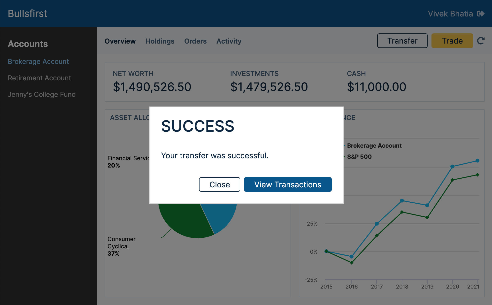
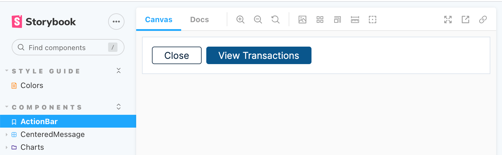
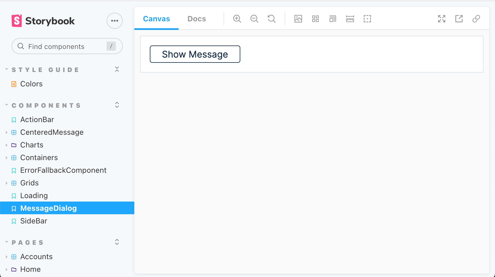
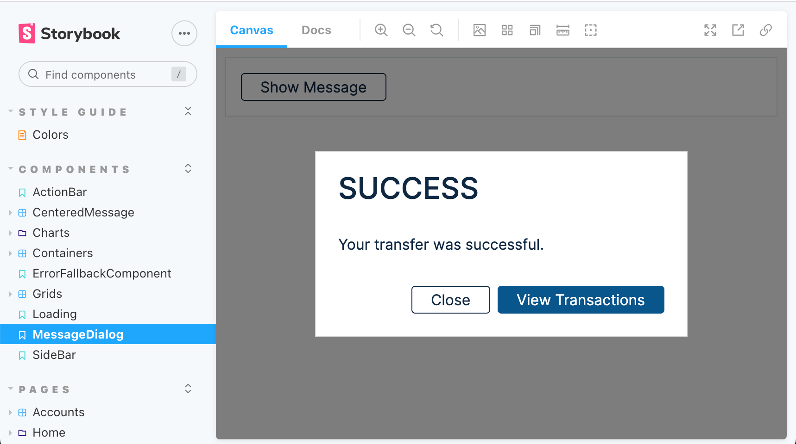

# Exercise 14: Message Dialog

In this exercise, we will implement a general purpose message dialog as shown in
the
[visual design](https://www.figma.com/file/UdOTt1Z2fTnm0Cbi0FA1We/Bullsfirst),
and repeated below for quick reference.



The message dialog can be invoked from anywhere in the application. It shows a
title, the message itself, and a variable number of buttons that perform
configurable actions.

We will implement the message dialog in two steps:

1. Implement the `ActionBar` consisting of variable number of action buttons.
2. Implement the `MessageDialog` itself, utilizing the `ActionBar` built in
   step 1.

## Exercise Instructions - ActionBar

We will develop the `ActionBar` using Storybook. Here's the finished story
showing an `ActionBar` with two buttons. When either of the buttons is clicked,
an alert pops up showing which button was pressed.



- The story is already given to you. Copy it from
  `/code/src/components/ActionBar/ActionBar.stories.tsx` to your repo.

- Here's the interface for the `ActionBar` component. Implement it, and make
  sure it works in Storybook. Hint: The actual implementation is no more than 20
  lines of code.

```tsx
export interface ButtonSpec {
  label: string;
  className?: string;
  type?: 'button' | 'reset' | 'submit';
  onClick: () => void;
}

export interface ActionBarProps {
  buttonSpecs: Array<ButtonSpec>;
}
```

- Write a unit test for `ActionBar`. Use the same button specification as the
  Storybook story, except that mock the click handlers so that you can verify
  that they are called when the buttons are clicked.

## Exercise Instructions - MessageDialog

We will develop the `MessageDialog` using Storybook. Here's the finished story
showing a button labeled _Show Message_. When this button is clicked, a
`MessageDialog` appears with two configured buttons.





We will use [Reactjs-popup](https://react-popup.elazizi.com/) to create Modals.
The library simply provides a dark overlay with a blank content area for the
modal. We will style the content area ourselves however we like!

- The story is already given to you. Copy it from
  `/code/src/components/MessageDialog/MessageDialog.stories.tsx` to your repo.
  Note that the story itself does not instantiate a `<MessageDialog>`, we will
  provide a singular instance through Storybook initialization, so that it is
  available to all stories.

- Add reactjs-popup to Bullsfirst client.

```sh
npm install reactjs-popup
# or
yarn add reactjs-popup
```

- Since the `MessageDialog` will be accessible from anywhere in the app, we will
  keep it at a very high level in the component tree. It will be hidden
  normally, but can be made visible by flipping a flag and providing the desired
  content. All this be managed using React Context. Create a context called
  `MessageContext` at `/src/components/MessageDialog/MessageContext.tsx`. Here's
  the state that will be stored in `MessageContext`. Implement it fully by
  supplying a `MessageContextProvider` and `useMessageContext`.

```tsx
import React, { useContext, useState } from 'react';
import { ButtonSpec } from '../ActionBar';

// ---------- MessageContext ----------
type MessageState = {
  showDialog: boolean;
  title?: string;
  message?: string;
  buttonSpecs?: Array<ButtonSpec>;
};
type MessageStateSetter = (messageState: MessageState) => void;

/** MessageContext contains MessageState and MessageStateSetter */
const MessageContext = React.createContext<
  | { messageState: MessageState; setMessageState: MessageStateSetter }
  | undefined
>(undefined);
```

- Implement `MessageDialog` at `/src/components/MessageDialog/MessageDialog.tsx`
  using Reactjs-popup. Do not use the `trigger` prop as shown in the examples,
  it is not very flexible. Instead, use the `open` prop as shown below. Use
  `MessageContex` to show or hide the dialog and render its contents.

```tsx
<Popup
  open={showDialog}
  closeOnDocumentClick={false}
  closeOnEscape={false}
  modal
  nested
>
  ...
</Popup>
```

- Now let's make the story work. As mentioned above, we will make the
  `MessageDialog` available to all stories using Storybook initialization. To do
  this, edit `/.storybook/preview.tsx` as follows. Note that we are providing
  the `MessageContext` at the highest level and keeping the `<MessageDialog>`
  adjacent to the `<Story>`. We are also adding the CSS for Reactjs-popup.

```tsx
...
import { MessageContextProvider, MessageDialog } from '../src/components';

...
import 'reactjs-popup/dist/index.css';
import '../src/styles/main.css';

...
  <MessageContextProvider>
    <EnvProvider>
      <ApolloProvider client={client}>
        <AuthContextProvider>
          <Story />
          <MessageDialog />
        </AuthContextProvider>
      </ApolloProvider>
    </EnvProvider>
  </MessageContextProvider>
);

addDecorator(StoryDecorator);
```

- Try out the story. Does `MessageDialog` work? Does it match the visual design?
  You might notice that default width of the model is 50% of the window width.
  Our design specifies a fixed with of 400px. To correct this, you must override
  the `popup-content` style provided by Reactjs-popup. Override as follows in
  main.css and then fix the width of `MessageDialog` to 400px.

```css
/* ----- Reactjs-popup Overrides ----- */
.popup-content {
  margin: auto;
  background: rgb(255, 255, 255);
  width: auto;
  padding: 0;
}
```

- Now let's modify `/src/test/test-utils.tsx` so that `MessageDialog` is
  available to all unit tests. The changes are very similar to Storybook
  initialization.

```tsx
const AllProviders: React.FC = ({ children }) => {
  return (
    <Suspense fallback={<Loading />}>
      <MessageContextProvider>
        <ErrorBoundary>
          <EnvProvider>
            <ApolloProvider client={apolloClient}>
              <AuthContextProvider>
                <Router>{children}</Router>
                <MessageDialog />
              </AuthContextProvider>
            </ApolloProvider>
          </EnvProvider>
        </ErrorBoundary>
      </MessageContextProvider>
    </Suspense>
  );
};
```

- Write a unit test for `MessageDialog`. Use a single close button (see the
  `MessageDialog` story). Verify that the `MessageDialog` can be opened and
  closed correctly.

- Finally, let's make the `MessageDialog` work in the real app. First modify
  `/src/index.css` to place the component high up in the component tree:

```tsx
...
import {
  ErrorBoundary,
  Loading,
  MessageContextProvider,
  MessageDialog,
} from './components';

...
import 'reactjs-popup/dist/index.css';
import './index.scss';
import './styles/main.css';

...
ReactDOM.render(
  <React.StrictMode>
    <Suspense fallback={<Loading />}>
      <MessageContextProvider>
        <ErrorBoundary>
          <EnvProvider>
            <ApolloProvider client={apolloClient}>
              <AuthContextProvider>
                <Router>
                  <App />
                  <MessageDialog />
                </Router>
              </AuthContextProvider>
            </ApolloProvider>
          </EnvProvider>
        </ErrorBoundary>
      </MessageContextProvider>
    </Suspense>
  </React.StrictMode>,
  document.getElementById('root')
);
```

- To test this setup, open the `MessageDialog` when the _Transfer_ button in the
  account header is clicked. This is just for temporary testing. In the next
  exercise, the _Transfer_ button will open the `TransferDialog` instead.

- Attach a screenshot of your implementation to your pull request.
