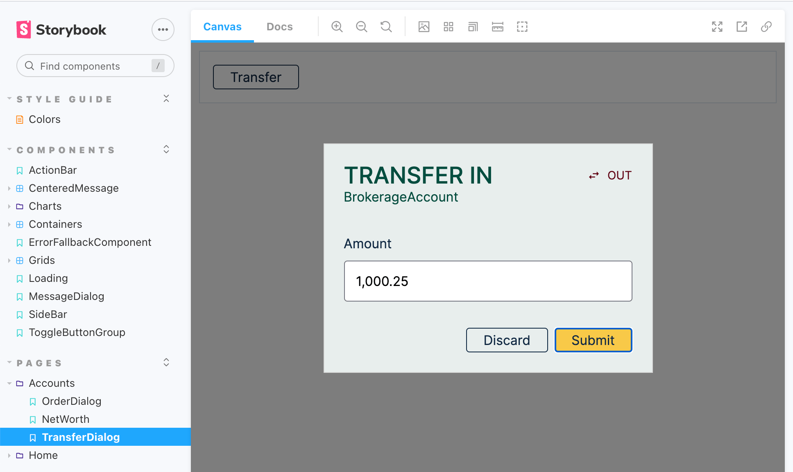

# Exercise 15: Transfer Dialog

In this exercise, we will implement the transfer dialog as shown in the
[visual design](https://www.figma.com/file/UdOTt1Z2fTnm0Cbi0FA1We/Bullsfirst),
and repeated below for quick reference.

.

The transfer dialog is opened by clicking the _Transfer_ button in the account
header. It shows the following elements:

1. Title: XFER IN or XFER OUT
2. Subtitle: The account in which the transfer is requested
3. Direction toggle: Allows to toggle the transfer direction between In & Out
4. Amount field: For entering transfer amount - up to 2 decimal places. As the
   user types digits, commas are added as thousands separators.
5. Action buttons: Dismiss & Submit

We will implement the message dialog in 3 steps:

1. Refactor `AccountsPage` to make the selected account's name available to all
   components on the page. This is needed for showing the account name in the
   `TransferDialog`.
2. Implement a reusable `NumberField`.
3. Implement the `TransferDialog` itself.

## Exercise Instructions - AccountsPage Refactoring

As mentioned above, we will first refactor `AccountsPage` to make the selected
account's name available to all components on the page.

- Start by creating an `AccountContext` at
  `/src/pages/AccountsPage/AccountContext.tsx`. This context will carry the
  account information:

```tsx
// ---------- AccountContext ----------
type AccountInfo = {
  id: string;
  name: string;
};

type AccountState = {
  account?: AccountInfo;
};

type AccountStateSetter = (accountState: AccountState) => void;

/** AccountContext contains AccountState and AccountStateSetter */
const AccountContext = React.createContext<
  | { accountState: AccountState; setAccountState: AccountStateSetter }
  | undefined
>(undefined);
```

- We need to add the `AccountContextProvider` to `AccountsPage` so that the
  context is available to all the components on the page. This context should be
  initialized using the `GetAccounts` query which is also executed on the same
  page. However, there is a problem. We cannot use the `useAccountContext` hook
  here because the corresponding provider (`AccountContextProvider`) is also on
  the same page. Try it!

- The solution to the above problem is to push the context initialization to a
  nested component on the page. Since the account list is primarily needed for
  the `SideBar`, let's create a component called `AccountsSideBar` at
  `/src/pages/AccountsPage/AccountsSideBar.tsx`. Move the `SideBar` and the
  `GetAccounts` query to `AccountsSideBar`. Make sure that your unit tests and
  the app still work!

- Now introduce the `AccountContextProvider` on the `AccountsPage`:

```tsx
<AccountContextProvider>
  <RefreshContextProvider>
    <ViewVerticalContainer>
      <Header />
      <HorizontalContainer className="min-h-0">
        <AccountsSideBar />
        <Outlet />
      </HorizontalContainer>
    </ViewVerticalContainer>
  </RefreshContextProvider>
</AccountContextProvider>
```

- Finally, add the `useAccountContext` hook to `AccountsSideBar`. Initialize
  `AccountContext` with the selected account everytime it changes.

## Exercise Instructions - NumberField

We will develop `NumberField` using Storybook. The implementation will use the
[react-number-format](https://github.com/s-yadav/react-number-format) component.

- The story is already given to you. Copy it from
  `/code/src/components/Form/NumberField.stories.tsx` to your repo.

- Add react-number-format to Bullsfirst client.

```sh
npm install react-number-format
# or
yarn add react-number-format
```

- Implement `NumberField` at `/src/components/Form/NumberField.tsx`. Use
  [this example](https://codesandbox.io/s/react-hook-form-normalize-field-forked-jhrq9)
  from react-hook-form. Here's the interface for `NumberField`:

```tsx
export interface NumberFieldProps {
  /** used to make label and errorText accessible for screen readers */
  id?: string;

  /** used to create data-testid property on element for testing */
  testId?: string;

  /** passed to the controller */
  name: string;

  /** the label content */
  label?: React.ReactNode;

  /** error text */
  error?: string;

  /* limits to given decimal scale */
  decimalScale?: number;

  /* RHF object containing methods to register components */
  control: any;
}
```

- Make sure the story works.

- Write two unit test for `NumberField`. The test form should contain the same
  two fields as in the story.

  1. displays a validation error if validation fails
  2. submits form information if all validations pass

## Exercise Instructions - TransferDialog

We will develop `TransferDialog` using Storybook. Here's the finished story
showing a button labeled _Transfer_. When this button is clicked, the
`TransferDialog` appears.



- Write a GraphQL mutation called `TransferCash` in
  `/src/pages/AccountsPage/TransferDialog/TransferDialog.query.graphql`. This
  mutation sends one variable called `TransferCashInput` to the GraphQL server.
  The server returns a `CashTransfer` if the operation is successful. Create a
  fragment called `CashTransferFields` in `/src/graphql/fragments.graphql`, and
  use it in your `TransferCash` mutation.

- Generate the code for the mutation by running `graphql:codegen`.

- Now let's implement the `TransferDialog` story. Actually, it is already given
  to you. Copy it from
  `/code/src/pages/AccountsPage/TransferDialog/TransferDialog.stories.tsx` to
  your repo.

- We will use a `TransferContext` to show/hide the `TransferDialog` from
  anywhere in the `AccountsPage`. Create a file for this at
  `/src/pages/AccountsPage/TransferDialog/TransferContext.tsx`.  
  Here's the specification for `TransferContext`. Implement the corresponding
  provider and hook.

```tsx
// ---------- TransferContext ----------
type TransferState = {
  showDialog: boolean;
};
type TransferStateSetter = (transferState: TransferState) => void;

/** TransferContext contains TransferState and TransferStateSetter */
const TransferContext = React.createContext<
  | { transferState: TransferState; setTransferState: TransferStateSetter }
  | undefined
>(undefined);
```

- Now implement `TransferDialog` at
  `/src/pages/AccountsPage/TransferDialog/TransferDialog.tsx`. Use reactjs-popup
  to implement the modal:

```tsx
<Popup
  open={showDialog}
  closeOnDocumentClick={false}
  closeOnEscape={false}
  modal
  nested
>
  <TransferForm defaultValues={defaultValues} onSubmit={handleSubmit} />
</Popup>
```

- Note that `TransferDialog` embeds a `TransferForm` within itself. Create
  `TransferForm` at `/src/pages/AccountsPage/TransferDialog/TransferForm.tsx`.
  Here's the interface for `TransferForm`:

```tsx
import { Direction, TransferCashInput } from '../../../graphql';

export interface TransferFormProps {
  defaultValues: Omit<TransferCashInput, 'amount'>;
  onSubmit: (transferCashInput: TransferCashInput) => void;
}
```

- Use `NumberField` to implement the Amount field. Create a separate component
  called `DirectionToggle` to implement the direction toggle. Create it in the
  same directory as `TransferForm`.

- When `TransferForm` submits, it sends `TransferCashInput` to the parent. Use
  this input to send the `TransferCash` mutation to the server. Show a success
  or error message depending on the response. Use the `MessageDialog` for this.
  Remember that you open the `MessageDialog` using `useMessageContext`.

- Implement a MSW handler to process the `TransferCash` mutation. This handler
  should do three things:

  1. Increase or decrease the cash balance for the account as requested. In case
     of transfer out, make sure there are sufficient funds in the account,
     otherwise return an error.
  2. Create a `CashTransfer` transaction and add it to the transactions array.
     Note that the `CashTransfer` requires the user id to be saved in the
     `createdBy` field. This means that you need to extract the user id from the
     access token.
  3. Return the `CashTransfer` as a result of the mutation.

- Now try out the `TransferDialog` story. Does it work? Note that the submission
  will return an 'Unauthorized' error because the story is not sending an access
  token to the serer. However, this will work in the real app.

- Write a unit test to test the `TransferDialog`. Here we can use Apollo's
  `MockProvider` to return a successful response even without sending an access
  token. Here's how to set up the test:

```tsx
import { MockedProvider } from '@apollo/client/testing';
...

const mocks = [
  {
    request: {
      query: TransferCashDocument,
      variables: {
        transferCashInput: {
          amount: 1000,
          accountId: 'brokerage-account',
          direction: 'OUT',
        },
      },
    },
    result: {
      data: {
        transferCash: {
          __typename: 'CashTransfer',
          id: 'transaction-001',
          type: 'CASH_TRANSFER',
          accountId: 'brokerage-account',
          createdAt: '2021-01-01T00:00:00Z',
          createdBy: 'naresh-bhatia',
          direction: 'OUT',
          amount: -1000,
        },
      },
    },
  },
];

const AccountInitializer = () => {
  const { setAccountState } = useAccountContext();

  useEffect(() => {
    setAccountState({
      account: { id: 'brokerage-account', name: 'Brokerage Account' },
    });
  }, [setAccountState]);

  return null;
};

const AccountHeader = () => {
  const { setTransferState } = useTransferContext();

  const handleTransferClicked = () => {
    setTransferState({ showDialog: true });
  };

  return <button onClick={handleTransferClicked}>Transfer</button>;
};

describe('TransferDialog', () => {
  it('allows initiating a transfer', async () => {
    const { findByText, getByLabelText, getByTestId, getByText, queryByText } =
      render(
        <MockedProvider mocks={mocks} addTypename={false}>
          <AccountContextProvider>
            <RefreshContextProvider>
              <TransferContextProvider>
                <AccountInitializer />
                <AccountHeader />
                <TransferDialog />
              </TransferContextProvider>
            </RefreshContextProvider>
          </AccountContextProvider>
        </MockedProvider>
      );
    ...
  });
});
```

- It's finally time to wire up our `TransferDialog` into the `AccountsPage`. Add
  `TransferContextProvider` and `TransferDialog` to the page as follows:

```tsx
<AccountContextProvider>
  <RefreshContextProvider>
    <TransferContextProvider>
      <ViewVerticalContainer>
        <Header />
        <HorizontalContainer className="min-h-0">
          <AccountsSideBar />
          <Outlet />
        </HorizontalContainer>
      </ViewVerticalContainer>
      <TransferDialog />
    </TransferContextProvider>
  </RefreshContextProvider>
</AccountContextProvider>
```

- One final step - modify `AccountsHeader` to open the `TransferDialog` when the
  _Transfer_ button is clicked:

```tsx
const handleTransferClicked = () => {
  setTransferState({ showDialog: true });
};
```

- Try out `TransferDialog` in the real app. Does it work end-to-end?

- One last thing - write an integration test called `cash-transfer.spec.js`
  using Cypress:

```js
describe('Cash Transfer', function () {
  it('allows transfer out if funds are available', function () {
    ...
  });

  it('does not allow transfer out if funds are not available', function () {
    ...
  });
});
```

- Attach a screenshot of your implementation to your pull request.
