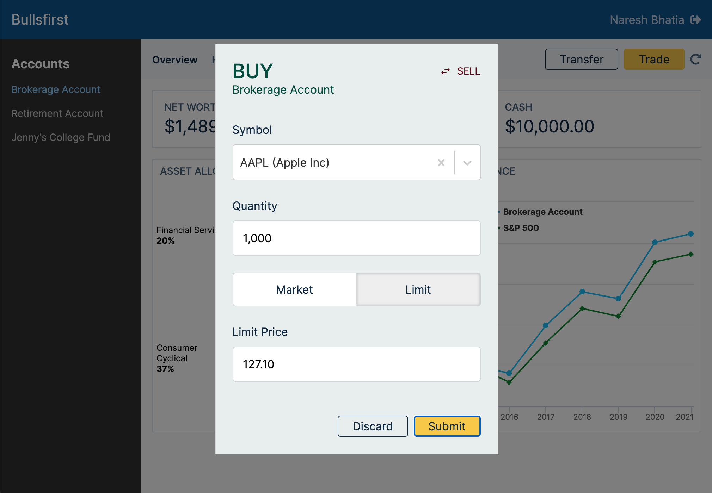
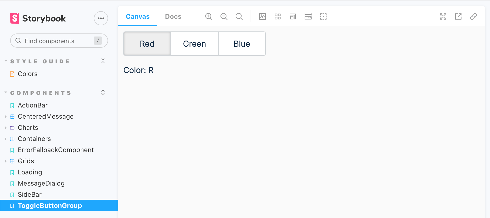

# Exercise 16: Order Dialog

In this exercise, we will implement the order dialog as shown in the
[visual design](https://www.figma.com/file/UdOTt1Z2fTnm0Cbi0FA1We/Bullsfirst),
and repeated below for quick reference.

.

The order dialog is opened by clicking the _Trade_ button in the account header.
It can also be opened from the Buy & Sell buttons in the Holdings grid. This
dialog shows the following elements:

1. Title: BUY or SELL
2. Subtitle: The account from which the order is requested
3. Side toggle: Allows to toggle the order between Buy & Sell
4. Symbol: A typeahead field to enter the security symbol
5. Quantity: For entering the quantity of stock - Whole numbers only. As the
   user types digits, commas are added as thousands separators.
6. Market/Limit toggle: Allows toggling between market and limit order
7. Limit Price: Shown only if order type is limit. Allows entering a limit price
   up to two decimals.
8. Action buttons: Discard & Submit

We will implement the message dialog in 4 steps:

1. Implement a reusable `AutocompleteField` to enter the symbol.
2. Implement a reusable `ToggleButtonGroup` to allow toggling between.
3. Implement the `OrderDialog` itself and wire it to the _Trade_ button.
4. Wire the `OrderDialog` to the _Buy_ & _Sell_ buttons in the Holdings grid.

## Exercise Instructions - AutocompleteField

We will develop `AutocompleteField` using Storybook. The implementation will use
[react-select](https://react-select.com). Specifically, we will use React Select
in [async mode](https://react-select.com/async) so that we can load symbols from
the GraphQL server as the user types.

- The story is already given to you. Copy it from
  `/code/src/components/Form/AutocompleteField.stories.tsx` to your repo. Note
  that React Select uses the concept of `options`. An option is composed of a
  `value` and a `label`. For example, our securities will have values like
  `AAPL` and labels like `AAPL (Apple Inc)`. However, note that an option does
  not have to have fields called `value` and `label`. We can supply functions to
  React Select to extract `value` and `label` from an option. For example, our
  AutocompleteField story supplies the following functions to React Select to
  extract a `value` and a `label` from a security:

```tsx
<AutocompleteField<Security>
  ...
  getOptionValue={(option) => option.id}
  getOptionLabel={(option) => `${option.id} (${option.name})`}
/>
```

- Note that React Select returns an option in its `onChange` event, not a simple
  string. So our code will have to accommodate for this behavior.

- Look at the `loadOptions` function in the story. Note that we are using
  `apolloClient.query` to directly fetch matching securities instead of
  `useQuery`. This approach allows us to bypass the Apollo cache completely.
  There is no need to keep the lookups in the cache.

- Add React Select to Bullsfirst client.

```sh
npm install react-select

# or

yarn add react-select
```

- Let's start by implementing the `GetSecurities` query. Add the following query
  to the file `/src/pages/AccountsPage/OrderDialog/OrderDialog.query.graphql`:

```graphql
query GetSecurities($query: String!) {
  securities(query: $query) {
    ...SecurityFields
  }
}
```

- Add the fragment used above to `/src/graphql/fragments.graphql`:

```graphql
fragment SecurityFields on Security {
  id
  name
}
```

- Generate the code from the schema by running `graphql:codegen`.

- Now implement the `GetSecurities` query in the mock server.

- Finally, implement `AutocompleteField` at
  `/src/components/Form/AutocompleteField.tsx`. Use
  [this example](https://codesandbox.io/s/react-hook-form-v6-controller-ts-jwyzw)
  from react-hook-form, but replace `ReactSelect` with the async version called
  `AsyncSelect`. Here's the interface for `AutocompleteField`:

```tsx
import React, { Fragment } from 'react';
import { Controller } from 'react-hook-form';
import AsyncSelect from 'react-select/async';
import { ErrorMessage } from './ErrorMessage';

export interface AutocompleteFieldProps {
  /** used to make label and errorText accessible for screen readers */
  id?: string;

  /** passed to the controller */
  name: string;

  /** the label content */
  label?: React.ReactNode;

  /** error text */
  error?: string;

  /* RHF object containing methods to register components */
  control: any;

  /* function to get the value of an option */
  getOptionValue: (option: any) => string;

  /* function to get the label for an option */
  getOptionLabel: (option: any) => string;

  /* function to load options based on input value */
  loadOptions: (inputValue: string) => Promise<Array<any>>;
}
```

- Make sure the story works.

## Exercise Instructions - ToggleButtonGroup

We will develop `ToggleButtonGroup` using Storybook. This implementation will be
from scratch, creating each toggle button using `<div>` tags. Here's a
screenshot of the finished story.

.

- The story is already given to you. Copy it from
  `/code/src/components/ToggleButtonGroup/ToggleButtonGroup.stories.tsx` to your
  repo.

- Implement `ToggleButtonGroup` at
  `/src/components/ToggleButtonGroup/ToggleButtonGroup.tsx`. Here's the
  interface for it:

```tsx
export interface ToggleButtonGroupProps {
  value: string | undefined;
  options: Array<{ value: string; label: string }>;
  onChange: (newValue: string) => void;
}
```

- Implement `ToggleButton` at
  `/src/components/ToggleButtonGroup/ToggleButton.tsx`. Here's the interface for
  it:

```tsx
export interface ToggleButtonProps {
  label: string;
  selected: boolean;
  onClick: () => void;
}
```

- Make sure the story works.

## Exercise Instructions - OrderDialog

We will develop `OrderDialog` using Storybook.

- Write a GraphQL mutation called `PlaceOrder` in
  `/src/pages/AccountsPage/OrderDialog/OrderDialog.query.graphql`. This mutation
  sends one variable called `OrderInput` to the GraphQL server. The server
  returns an `Order` if the operation is successful. Create a fragment called
  `OrderFields` in `/src/graphql/fragments.graphql`, and use it in your
  `PlaceOrder` mutation.

- Generate the code for the mutation by running `graphql:codegen`.

- Implement a MSW handler to process the `PlaceOrder` mutation. This handler
  should do the following:

  1. If limit order and limit price is not met, then simply place the order,
     don't execute it.
  2. Based on buy vs. sell order, validate that the required cash or holdings
     are available. If not, throw an error.
  3. If all validations pass, then execute the order. This implies that increase
     or decrease the cash balance for the account as appropriate. Similarly,
     increase or decrease the holdings as appropriate.
  4. Create a `Trade` transaction and add it to the transactions array.
  5. Mark the order as executed and return it as the result of the mutation.

- Now copy the `OrderDialog` story from
  `/code/src/pages/AccountsPage/OrderDialog/OrderDialog.stories.tsx` to your
  repo.

- We will use a `OrderContext` to show/hide the `OrderDialog` from anywhere in
  the `AccountsPage`. We will also use it to populate initial values when
  triggered from the holdings grid. Create a file for this at
  `/src/pages/AccountsPage/OrderDialog/OrderContext.tsx`.  
  Here's the specification for `OrderContext`. Implement the corresponding
  provider and hook.

```tsx
// ---------- OrderContext ----------
// everything that OrderDialog allows to enter is kept as optional
export type OrderDefaults = {
  accountId: string;
  side?: Side;
  security?: {
    id: string;
    name: string;
  };
  quantity?: number;
  type?: OrderType;
  limitPrice?: number;
};

type OrderState = {
  showDialog: boolean;
  orderDefaults?: OrderDefaults;
};
type OrderStateSetter = (orderState: OrderState) => void;

/** OrderContext contains OrderState and OrderStateSetter */
const OrderContext = React.createContext<
  { orderState: OrderState; setOrderState: OrderStateSetter } | undefined
>(undefined);
```

- Now implement `OrderDialog` at
  `/src/pages/AccountsPage/OrderDialog/OrderDialog.tsx`. Use reactjs-popup to
  implement the modal:

```tsx
<Popup
  open={showDialog}
  closeOnDocumentClick={false}
  closeOnEscape={false}
  modal
  nested
>
  <OrderForm onSubmit={handleSubmit} />
</Popup>
```

- Note that `OrderDialog` embeds an `OrderForm` within itself. Create
  `OrderForm` at `/src/pages/AccountsPage/OrderDialog/OrderForm.tsx`. Here's the
  interface for `OrderForm`:

```tsx
import { GetSecuritiesDocument, OrderType, Side } from '../../../graphql';
import { useOrderContext } from './OrderContext';

type Security = { id: string; name: string };

export type Order = {
  accountId: string;
  side: Side;
  security: Security;
  quantity: number;
  type: OrderType;
  limitPrice?: number;
};

export interface OrderFormProps {
  onSubmit: (order: Order) => void;
}
```

- Use `AutocompleteField`, `NumberField` and `ToggleButtonGroup` in your
  implementation.

- Create a separate component called `SideToggle` to implement the buy/sell
  toggle. Create it in the same directory as `OrderForm`. Here's the interface
  for it. Note the import used for the icon.

```tsx
import { MdSwapHoriz } from 'react-icons/md';

export interface SideToggleProps {
  side: Side;
  onClick: () => void;
}
```

- When `OrderForm` submits, it sends an `Order` object to the parent. Transform
  this object to `OrderInput` and use it to send the `PlaceOrder` mutation to
  the server. Show a success or error message depending on the response. Use the
  `MessageDialog` for this. Remember that you open the `MessageDialog` using
  `useMessageContext`.

- Now try out the `OrderDialog` story. Does it work? Note that the submission
  will return an 'Unauthorized' error because the story is not sending an access
  token to the serer. However, this will work in the real app.

- Write a unit test to test the `OrderDialog`. Here we can use Apollo's
  `MockProvider` to return a successful response even without sending an access
  token. Here's how to set up the test:

```tsx
import { MockedProvider } from '@apollo/client/testing';
...

const mocks = [
  {
    request: {
      query: GetSecuritiesDocument,
      variables: {
        query: 'AAPL',
      },
    },
    result: {
      data: {
        securities: [
          {
            __typename: 'Security',
            id: 'AAPL',
            name: 'Apple Inc',
          },
        ],
      },
    },
  },
  {
    request: {
      query: PlaceOrderDocument,
      variables: {
        orderInput: {
          accountId: 'brokerage-account',
          side: Side.Sell,
          symbol: 'AAPL',
          quantity: 100,
          type: OrderType.Limit,
          limitPrice: 130,
        },
      },
    },
    result: {
      data: {
        order: {
          __typename: 'Order',
          id: uuidv4(),
          side: Side.Sell,
          symbol: 'AAPL',
          quantity: 100,
          type: OrderType.Market,
          limitPrice: null,
          status: OrderStatus.Placed,
          accountId: 'brokerage-account',
          createdAt: '2021-01-01T00:00:00Z',
          createdBy: 'naresh-bhatia',
        },
      },
    },
  },
];
```

- It's finally time to wire up our `OrderDialog` into the `AccountsPage`. Add
  `OrderContextProvider` and `OrderDialog` to the page as follows:

```tsx
<AccountContextProvider>
  <RefreshContextProvider>
    <OrderContextProvider>
      <TransferContextProvider>
        <ViewVerticalContainer>
          <Header />
          <HorizontalContainer className="min-h-0">
            <AccountsSideBar />
            <Outlet />
          </HorizontalContainer>
        </ViewVerticalContainer>
        <OrderDialog />
        <TransferDialog />
      </TransferContextProvider>
    </OrderContextProvider>
  </RefreshContextProvider>
</AccountContextProvider>
```

- One final step - modify `AccountsHeader` to open the `OrderDialog` when the
  _Trade_ button is clicked:

```tsx
const handleTradeClicked = () => {
  setOrderState({ showDialog: true });
};
```

- Try out `OrderDialog` in the real app. Does it work end-to-end?

- One last thing - write an integration test called `trade.spec.js` using
  Cypress:

```js
describe('Order Dialog', function () {
  it('allows user to place a buy order at market price', function () {
    ...
  });

  it('allows user to place a sell order at market price', function () {
    ...
  });

  it('allows user to place a sell order at limit price', function () {
    ...
  });

  it('shows an error if there are not sufficient funds for a buy market order', function () {
    ...
  });

  it('shows an error if there is not sufficient quantity for a sell market order', function () {
    ...
  });

  ...
});
```

## Exercise Instructions - Wire OrderDialog to Holdings grid

- Modify `/src/pages/AccountsPage/Holdings/ActionsRenderer.tsx` so that
  `OrderDialog` is opened when either the _Buy_ or the _Sell_ button is clicked.
  This time the `OrderDialog` should be pre-populated with the side, security
  and quantity associated with the row clicked.

- Attach a screenshot of your `OrderDialog` implementation to your pull request.
