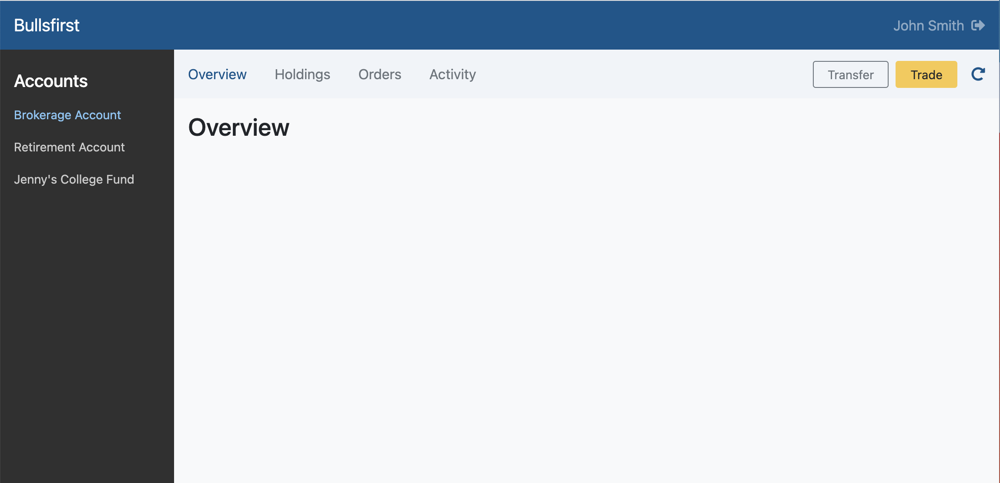

# Exercise 3: Accounts Page

In this exercise, we will

1. Create a skeleton of the Accounts page as show below.
2. We will include the `SideBar` that was implemented in exercise 2.
3. We will add an `AccountHeader` consisting of 4 links (Overview, Holdings
   Orders & Activity) and 3 buttons (Transfer, Trade and Refresh).
4. We will add dummy content for Overview, Holdings, Orders & Activity tabs.
5. We will add routing that allows the user to navigate from Sign-in page to the
   Accounts page on successful sign-in.
6. The Accounts page will query the server to get all the accounts owned by the
   user. Use a mock server for this step.
7. The Accounts page will then land on the Overview tab and show the information
   for the first user account.



Use React Router's
[nested routes](https://github.com/ReactTraining/react-router/blob/dev/docs/installation/getting-started.md#nested-routes)
feature to navigate to the 4 tabs on the Account page:

```typescript jsx
export const App = () => {
  return (
    <Routes>
      <Route path="/" element={<SignIn />} />
      <Route path="/accounts" element={<Accounts />}>
        <Route path=":accountId" element={<Account />}>
          <Route path="overview" element={<Overview />} />
        </Route>
      </Route>
      <Route path="*" element={<NotFound />} />
    </Routes>
  );
};
```

For example, if the user has an account with id = 1234, the route for the
overview tab will be `/accounts/1234/overview`.

Also use React Router's
[NavLink](https://github.com/ReactTraining/react-router/blob/dev/docs/api-reference.md#navlink)
component to create the 4 links on the Account page.

- Make sure you have good unit test coverage.
- Write an integration test using Cypress that starts from the Sign-in page and
  navigates to the Accounts page.
- Attach a screenshot of your implementation to your pull request.
