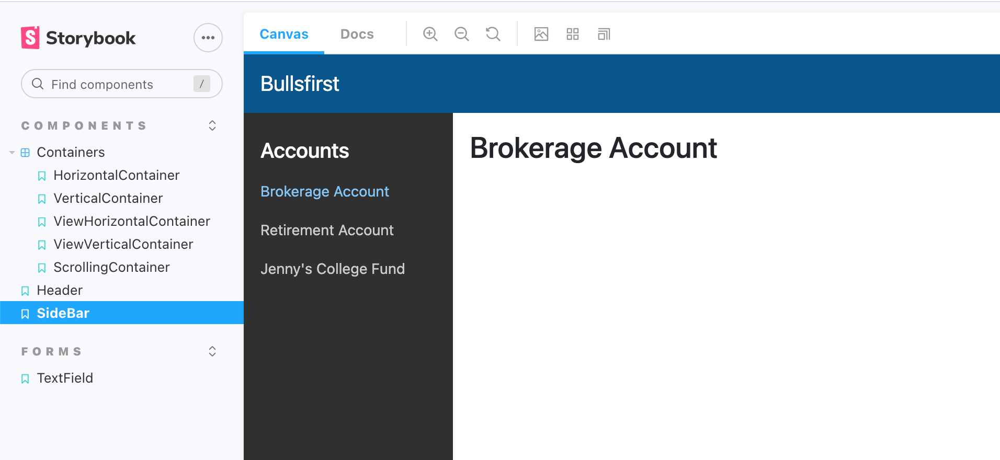

# Exercise 3: SideBar

Implement a reusable `SideBar` component as shown below. The sidebar should
extend to the bottom of the page even when the window is resized.

The component should be stateless. It will receive the following props and
inform its parent about user interactions using the handler passed in the
`onNavItemSelected` prop.

1. `title`: string (optional)
2. `items`: an array of `NavItems` containing { id: string, title: string }
3. `selectedNavItemId`: string
4. `onNavItemSelected`: function to be called when a NavItem is selected. This
   signature is (navItemId: string) => void;

- We will use Storybook to develop this component. It will not be used in the
  Bullsfirst app as part of this exercise.
- The story should wrap the SideBar component and maintain the state of the
  selected nav item. It should show the title of the selected nav item on the
  right-hand side.
- Make sure you have good unit test coverage, e.g. test that `onNavItemSelected`
  is called with the correct parameter when a nav item is selected.
- Attach a screenshot of your Storybook story to your pull request.

## References

1. [React Force SideBar Story](https://nareshbhatia.github.io/react-force/?path=/story/core-sidebar--side-bar-story)
2. [React Force SideBar Code](https://github.com/nareshbhatia/react-force/blob/master/packages/core/src/NavBar/SideBar.tsx)
